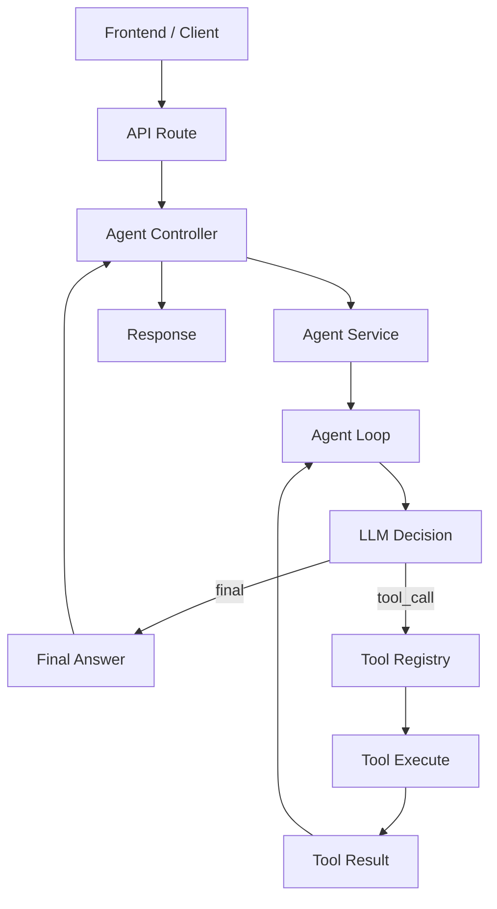
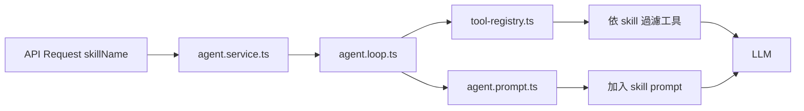

# Agent 流程文件

這份文件整理目前專案中 Agent 後端的主要流程，方便對照程式碼理解：

- 使用者訊息如何進入後端
- 模型如何判斷是否需要工具
- 工具結果如何再回到模型
- 最終答案如何回傳給前端

## 整體流程



## 時序圖

```mermaid
sequenceDiagram
    participant Frontend
    participant Route as API Route
    participant Controller as Agent Controller
    participant Service as Agent Service
    participant Loop as Agent Loop
    participant Prompt as Agent Prompt
    participant LLM as LLM Service
    participant Registry as Tool Registry
    participant Tool as Tool
    participant Provider as LLM Provider

    Frontend->>Route: POST /api/agent/chat
    Route->>Controller: chat(req, res)
    Controller->>Service: run(message)
    Service->>Loop: runAgentLoop(message)
    Loop->>Registry: getToolList()
    Registry-->>Loop: tools[]
    Loop->>Prompt: buildAgentSystemPrompt(tools)
    Prompt-->>Loop: systemPrompt
    Loop->>LLM: askAgentDecision(messages)
    LLM->>Provider: getAgentDecision(messages)
    Provider-->>LLM: AgentDecision

    alt decision.type === final
        LLM-->>Loop: { type: "final", answer }
        Loop-->>Service: answer
        Service-->>Controller: reply
        Controller-->>Frontend: { reply }
    else decision.type === tool_call
        LLM-->>Loop: { type: "tool_call", toolName, toolInput }
        Loop->>Registry: getToolByName(toolName)
        Registry-->>Loop: tool
        Loop->>Tool: execute(toolInput)
        Tool-->>Loop: toolResult
        Loop->>LLM: askAgentDecision(messages + toolResult)
        LLM->>Provider: getAgentDecision(messages + toolResult)
        Provider-->>LLM: final decision
        LLM-->>Loop: { type: "final", answer }
        Loop-->>Service: answer
        Service-->>Controller: reply
        Controller-->>Frontend: { reply }
    end
```

## 工具資訊如何提供給模型

模型不會直接讀專案中的工具檔案，而是由後端先把工具資訊組進 prompt，再交給模型判斷。

```mermaid
flowchart LR
    A[tool-registry.ts] --> B[getToolList()]
    B --> C[agent.prompt.ts]
    C --> D[system prompt]
    D --> E[LLM]
    E --> F{判斷結果}
    F -->|需要工具| G[tool_call]
    F -->|不需要工具| H[final]
```

## Skill 機制

目前專案已加入 Skill v1，Skill 不是新的工具，而是「任務場景設定層」。

Skill 主要負責：

- 提供額外 prompt 規則
- 限制可使用的工具範圍
- 讓模型在特定任務情境下有更穩定的行為

### 目前 Skill 結構

- `services/skills/core/skill-registry.ts`
  - 管理可用 skill
- `services/skills/definitions/investment-analysis.skill.ts`
  - 投資分析 skill
- `services/skills/definitions/weather-summary.skill.ts`
  - 天氣摘要 skill

### 目前已提供的 Skill

- `investment_analysis`
  - 偏向投資相關問題
  - 允許工具：
    - `get_stock_price`
    - `calculator`
    - `summarize_text`
- `weather_summary`
  - 偏向天氣查詢、重點整理與生活提醒
  - 允許工具：
    - `get_weather`
    - `summarize_text`

### Skill 如何影響流程



### 目前前端用法

前端已提供 skill 選單，送出請求時會一併帶上：

```json
{
  "sessionId": "可選",
  "skillName": "investment_analysis",
  "message": "幫我查 0050 股價，再幫我算如果上漲 10% 會是多少"
}
```

也可以改成：

```json
{
  "sessionId": "可選",
  "skillName": "weather_summary",
  "message": "台北今天天氣怎麼樣"
}
```

## 多工具串接策略

目前專案採用「多輪單工具串接」策略，而不是一次要求模型回傳多個工具呼叫。

原因是：

- 比較容易 debug
- 每一輪只做一個決策，模型比較不容易混亂
- tool result 可以在下一輪成為明確上下文
- 比較符合目前的 `AgentDecision` 型別設計

### 建議流程

1. 模型先判斷是否需要工具
2. 若需要，只回一個 `tool_call`
3. 工具執行後，後端把 `tool_result` 回灌到對話上下文
4. 模型根據最新工具結果決定：
   - 再用下一個工具
   - 或直接回 `final`

### 為什麼要讓 tool result 更結構化

如果 tool result 只是自由文字，模型在第二輪之後比較難穩定接續推理。

目前後端已改成回灌類似這樣的結構：

```json
{
  "type": "tool_result",
  "toolName": "calculator",
  "toolInput": {
    "expression": "10000 * 1.05^3"
  },
  "toolResult": "{\"tool\":\"calculator\",\"expression\":\"10000 * 1.05^3\",\"result\":11576.25}"
}
```

這樣模型在下一輪更容易理解：

- 剛剛用了哪個工具
- 傳了什麼輸入
- 工具回了什麼結果

## 多工具測試案例

可以用下面這種問題驗證目前的 loop 是否能正確做多步驟決策：

```text
幫我查 0050 股價，再幫我算如果上漲 10% 會是多少
```

理想流程是：

1. 第 1 輪：模型回 `get_stock_price`
2. 第 2 輪：模型讀到股價結果後，回 `calculator`
3. 第 3 輪：模型根據計算結果回 `final`

如果中間沒有接起來，優先檢查：

- prompt 是否明確允許多輪單工具串接
- tool result 是否夠結構化
- log 中每一輪 decision 是否合理

## 目前各層責任

## Services 結構

目前 `backend/src/services` 已整理成一致的分層方式：

- `agent/`
  - `core/`: Agent 主流程、prompt、types、registry
  - `index.ts`: Agent domain 的統一出口
- `llm/`
  - `core/`: LLM service 與 provider 介面
  - `providers/`: 各家 LLM provider 實作
  - `index.ts`: LLM domain 的統一出口
- `session/`
  - `core/`: 會話與歷史訊息存取
  - `index.ts`: Session domain 的統一出口
- `skills/`
  - `core/`: skill registry 與 skill types
  - `definitions/`: 各個 skill 定義
  - `index.ts`: Skills domain 的統一出口
- `tools/`
  - `core/`: tool framework、types、executor、errors
  - `definitions/`: 各個 tool 定義
  - `index.ts`: Tools domain 的統一出口

### 為什麼要這樣整理

- `core/` 放框架與 service 主流程
- `definitions/` 或 `providers/` 放具體實作
- `index.ts` 讓外層引用可以走單一出口，減少深層路徑依賴

### 目前建議的引用方式

- controller 引用 service 時，優先走 domain `index.ts`
- domain 內部若沒有循環風險，也優先走同 domain 的 `index.ts`
- 若可能造成循環依賴，則保留直接引用具體檔案

### 1. `routes`

- 接 API 路徑
- 目前入口為 `POST /api/agent/chat`

### 2. `controllers`

- 處理 request / response
- 從 request 取出 `message`
- 呼叫 `agentService.run(message)`
- 回傳 `{ reply }`

### 3. `services/agent/core`

- `agent.service.ts`
  - Agent 對外入口
- `agent.loop.ts`
  - 執行多輪 Agent 流程
- `agent.prompt.ts`
  - 組合 system prompt
- `tool-registry.ts`
  - 管理可用工具

### 4. `services/llm`

- `core/`
  - 抽象 LLM 呼叫
- `providers/`
  - 目前透過 OpenAI-compatible provider 呼叫 Groq

### 5. `services/tools`

- `core/`
  - 提供統一工具框架、executor、timeout / retry 與錯誤格式
- `definitions/`
  - 每個工具各自負責：
  - 驗證輸入
  - 執行邏輯
  - 回傳結果

## 目前已接上的工具

- `calculator`
  - 計算數學式
- `summarize_text`
  - 摘要與條列文字
- `get_stock_price`
  - 使用 TWSE 月資料查詢最新收盤價
- `get_weather`
  - 使用 Open-Meteo geocoding + forecast API 查詢目前天氣

## 範例：查詢天氣

當使用者輸入 `台北今天天氣怎麼樣` 時，流程會是：

1. 使用者訊息進入 Agent Loop
2. 模型看到可用工具中有 `get_weather`
3. 模型回傳 `tool_call`
4. 後端先透過 geocoding API 解析地點，再查詢 forecast API
5. 工具結果回到對話上下文
6. 模型整理成自然語言天氣摘要

## 範例：Weather Skill

當使用者指定 `weather_summary` 並輸入：

```text
台北今天天氣怎麼樣
```

流程會是：

1. API 帶入 `skillName=weather_summary`
2. Agent loop 根據 skill 過濾可用工具
3. 模型回 `get_weather`
4. 天氣工具回傳結構化資料
5. 模型根據天氣資料輸出摘要與生活提醒

## 範例：查詢股價

當使用者輸入 `0050 股價` 時，流程會是：

1. 使用者訊息進入 Agent Loop
2. 模型看到可用工具中有 `get_stock_price`
3. 模型回傳 `tool_call`
4. 後端執行 `get_stock_price`
5. 工具結果回到對話上下文
6. 模型再產生最終自然語言答案

## 範例：Skill + 多工具

當使用者指定 `investment_analysis` 並輸入：

```text
幫我查 0050 股價，再幫我算如果上漲 10% 會是多少
```

流程會是：

1. API 帶入 `skillName=investment_analysis`
2. Agent loop 根據 skill 過濾可用工具
3. 模型先回 `get_stock_price`
4. 工具結果回灌後，模型再回 `calculator`
5. 最後模型產生投資語境下的自然語言答案

## 範例：數學計算

當使用者輸入 `幫我算 10000 * 1.05^3` 時，流程會是：

1. 模型回傳 `tool_call`
2. 後端執行 `calculator`
3. `calculator` 透過 `math.ts` 計算結果
4. 結果回傳給模型
5. 模型整理成自然語言答案
